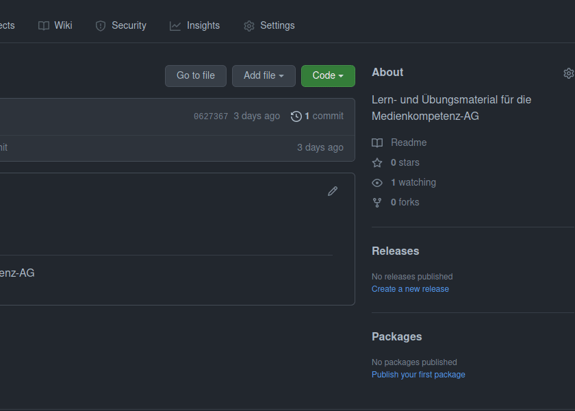

<h1 align="middle">Medienkompetenz-AG</h1>

Lern- und Übungsmaterial für die Medienkompetenz-AG.

## Wie bekomme ich das Material?

<table style="border: 1px solid transparent">
    <tr>
        <td>
            <h3>1. Material herunterladen </h3>
            Um das Material runterzuladen, geh dafür auf
            
            und dann auf 
            
            .
        </td>
        <td>
            
        </td>
    </tr>
    <tr>
        <td>
        
        </td>
        <td>
            <h3>2. Material extrahieren</h3>
            Nachdem das Zip-Archiv heruntergeladen ist, entpacke es mit Rechten-Maustaste auf die Datei
            über den Menüpunkt []. Danach kann das Zip-Archiv gelöscht werden.
        </td>
    </tr>
</table>

## Kontakte
Bei Fragen oder Problemen könnt ihr gerne mich anschreiben:  
E-Mail: 3ricsonn@protonmail.com